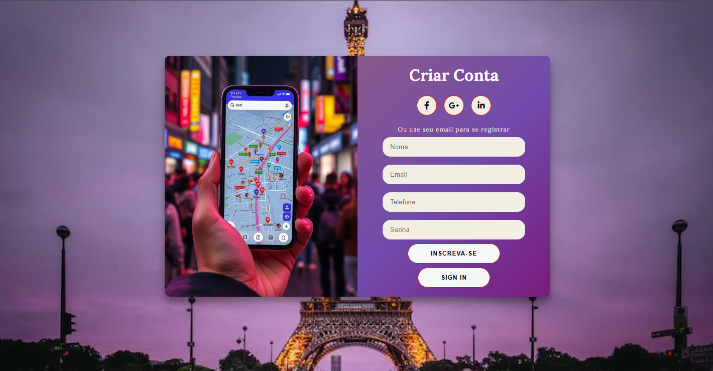
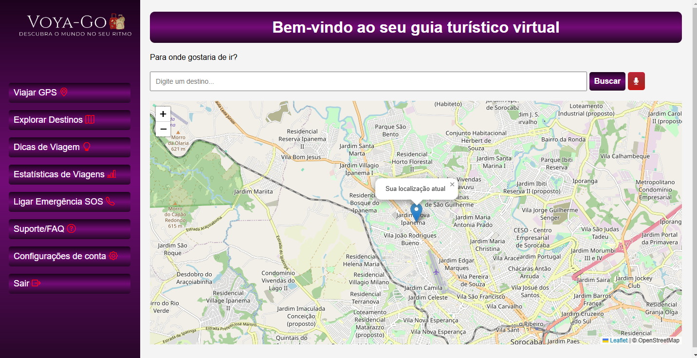
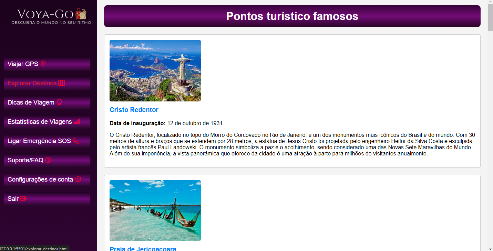
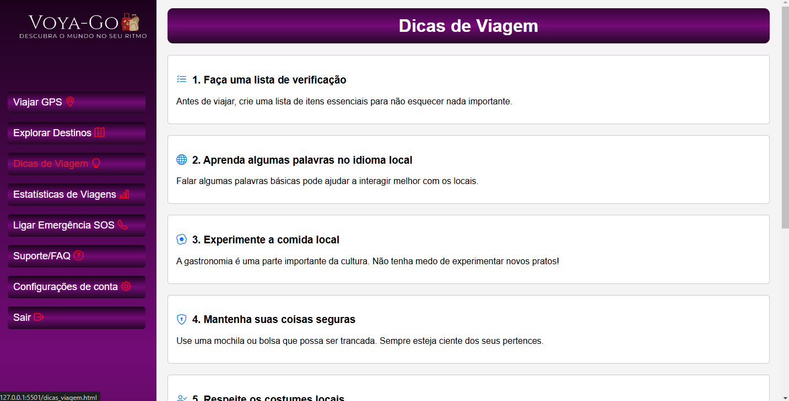
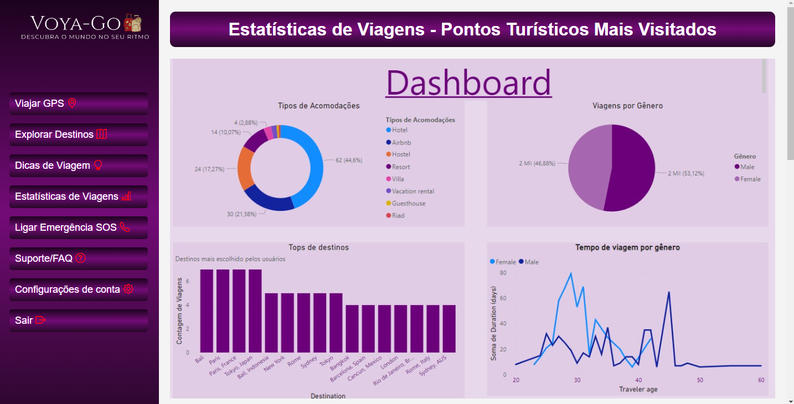
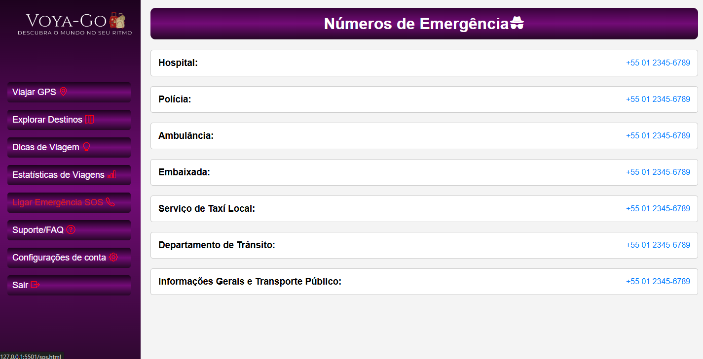
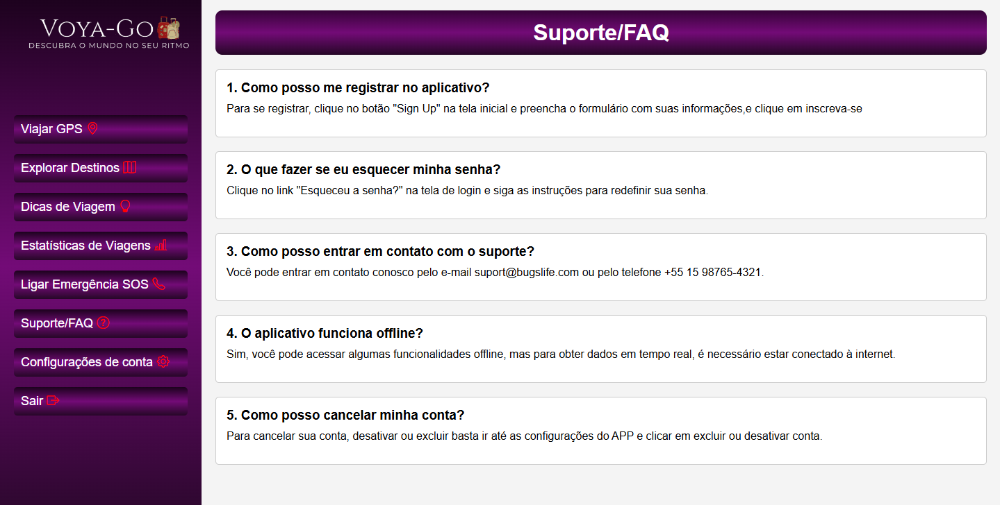
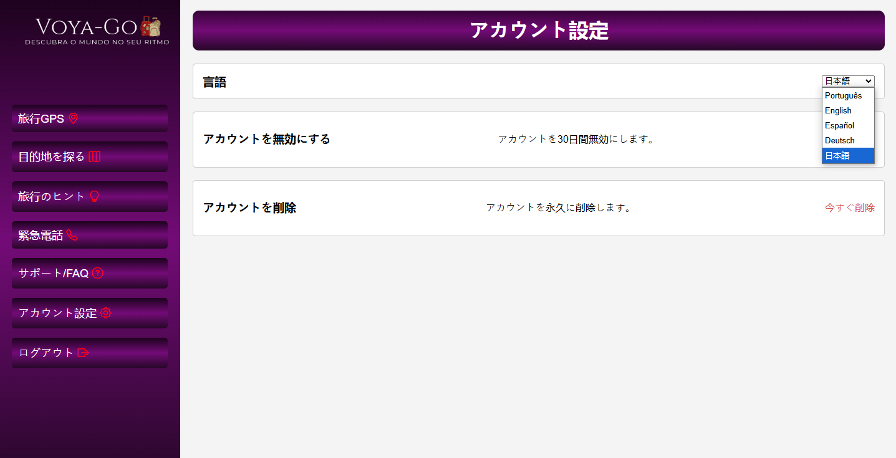

# Voya-Go 🌍

Bem-vindo ao **Voya-Go**, seu guia turístico virtual que torna a exploração de destinos famosos pelo mundo mais fácil e interativa! Com um design moderno e funcionalidades inovadoras, o Voya-Go é a ferramenta perfeita para planejar sua próxima aventura.

## 🛠️ Tecnologias Utilizadas

Este projeto foi desenvolvido utilizando as seguintes tecnologias:

- **HTML5**: Estruturação e marcação semântica do conteúdo.
- **CSS3**: Estilização e design responsivo.
- **JavaScript**: Interatividade e manipulação dinâmica de elementos.
- **Node.js**: Backend e integração com o banco de dados.
- **MySQL**: o banco de dados.

## 🚀 Funcionalidades

- **Cadastro e Login de Usuário**: Registre-se e acesse seu painel de controle personalizado.
- **Explorar Destinos**: Descubra pontos turísticos famosos com informações detalhadas e localização no mapa.
- **Viajar GPS**: Navegação integrada para encontrar pontos turísticos.
- **Dicas de Viagem**: Sugestões úteis para tornar sua viagem mais confortável.
- **Ligar Emergência**: Acesso rápido a números de emergência locais.
- **Configurações de Conta**: Gerencie suas preferências e configurações de idioma.
- **Estatísticas de Viagens**: Visualize dados de uso e análises de pontos turísticos com Power BI.
- **Reconhecimento de Voz**: Pesquise destinos utilizando comandos de voz.

## 🌟 Destaques

- **Multilinguagem**: Suporte a cinco idiomas (Inglês, Português, Espanhol, Alemão, Japonês).
- **Design Responsivo**: Interface adaptável para dispositivos móveis e desktop.
- **Integração com Mapas**: Visualize e explore locais usando OpenLayers ou HERE Maps.
- **Interface Interativa**: Menus e dashboards amigáveis com acesso fácil a todas as funcionalidades.

